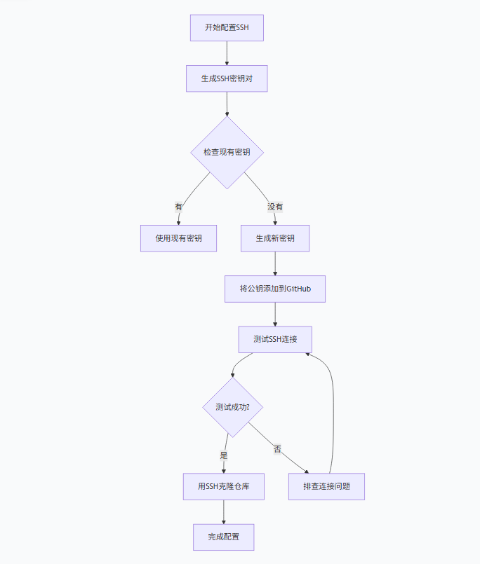

# github 基本使用


## 1、git 仓库管理

### 1.1 ssh配置

 

1. 生成SSH密钥对

   ```
   ssh-keygen -t ed25519 -C "your_email@example.com"
   #推荐使用更安全的 ed25519 算法
   ```

2. 将公钥添加到GitHub账户

   ```
   cat ~/.ssh/id_ed25519.pub
   ```

3. 测试SSH连接并开始使用

   ```
   ssh -T git@github.com
   ```

### 1.2 仓库管理

1. 远程仓库建立
2. 本地仓库初始化 `git init`
3. 添加远程仓库`git remote add origin git@github.com:Loren3Ben/仓库名.git`
4. 更换远程仓库`git remote set-url origin git@github.com:Loren3Ben/仓库名.git`
5. 查看当前配置的仓库`git remote -v`

